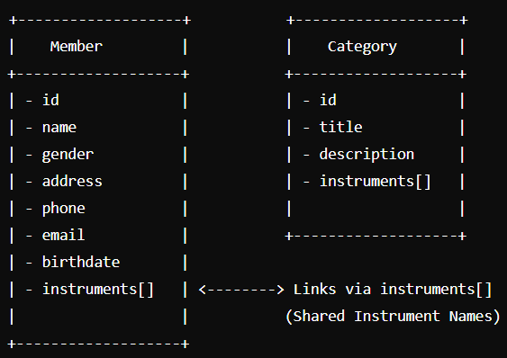

# Orkest hub
# Domain Model

## Description

The domain model for this application is simple. These entities (MongoDB Documents) allow the system to manage members based on instruments and categories. Below is a description of the entities and their relationships:

## 1. Category

Represents a group of instruments or a specific section in the orchestra (e.g., Strings, Winds).

### Attributes:

**id:** String. Unique identifier (generated by Mongo).

**title:** String. The name of the category.

**description:** String. A brief description of the category.

**icon:** String. An associated visual icon for representation.

**instruments:** String[]. List of instruments in the category.

## 2. Member

Represents a person who is part of the orchestra.

### Attributes:

**id:** String. Unique identifier (created by Mongo).

**name:** Object. Consists of first and last name.

**gender:** Enumeration. Male, Female or X.

**address:** Object. Includes street, number, city, and postalcode.

**email:** String. Contact email.

**phone:** String. Contact phone number.

**birthdate:** Date. Date of birth.

**memberSince:** Date. Date the member joined the orchestra.

**instruments:** String[]. List of instruments the member plays.

**picture:** String. URL or path to the member's profile picture.

**management:** Boolean. Field indicating if the member is part of the management team.

## 3. Relationships

Each Member may belong to a specific Category based on their instruments.

Categories can have multiple Members associated through their instruments.

Instruments are shared between Categories and Members, linking these entities logically.

# Visual Representation

This domain model ensures that the orchestral management application is logically structured, making it easy to add new members.

## API Documentation

You can view the API documentation for this project here:

[Orkest Hub API Documentation (swagger)](https://orkest-hub-9089f910375e.herokuapp.com/swagger-ui/index.html)

## CRUD Functionality in the Project

### Full CRUD Functionality

The **MemberController** provides full CRUD functionality for the `Member` entity:

1. **Create**:
    - **Endpoint**: `/api/members`
        - **Method**: POST
        - Allows for the creation of a new member resource with validation and proper error handling.

2. **Read**:
    - **Endpoint**: `/api/members`
        - **Method**: GET
        - Retrieve a full list of members.
    - **Endpoint**: `/api/members/{id}`
        - **Method**: GET
        - Retrieve a single member by ID.
    - **Endpoint**: `/api/members/instrument/{instrument}`
        - **Method**: GET
        - Retrieve members by the instrument they play.
    - **Endpoint**: `/api/members/category/{categoryId}`
        - **Method**: GET
        - Retrieve members in a specific category.
    - **Endpoint**: `/api/members/management`
        - **Method**: GET
        - Retrieve members in a management role.

3. **Update**:
    - **Endpoint**: `/api/members/{id}`
        - **Method**: PUT
        - Allows updating of a member's details with validation for input and handling of edge cases (e.g., invalid IDs).

4. **Delete**:
    - **Endpoint**: `/api/members/{id}`
        - **Method**: DELETE
        - Deletes an existing member resource, ensuring it respects dependencies with related entities (e.g., category assignments).

#### Limited Functionality

The **CategoryController** provides limited CRUD functionality for the `Category` entity:

1. **Read**:
    - **Endpoint**: `/api/categories`
        - **Method**: GET
        - Retrieve a list of all categories.
    - **Endpoint**: `/api/categories/{id}`
        - **Method**: GET
        - Retrieve a single category by its ID.

2. **Create**, **Update**, and **Delete**:  
   These operations are not included in the current implementation for the `Category` entity. The controller focuses on read operations.

Additionally, the **CategoryController** provides the following extended functionality:
- **Endpoint**: `/api/categories/instruments`
    - **Method**: GET
    - Retrieve all unique instruments across categories.

#### Extended Endpoints

These are extra endpoints added as extensions to the basic CRUD requirements:

1. **Endpoint**: `/api/members/instrument/{instrument}`
    - **Method**: GET
    - Retrieve all members who play a specific instrument.
2. **Endpoint**: `/api/categories/instruments`
    - **Method**: GET
    - Retrieve all unique instruments available across categories.

## Source references

This project was created with the help of ChatGPT-4 (https://openai.com).
I used ChatGPT to generate mock-up data, interpret errors, and write pieces of code I struggled with (mainly for tests).

No other sources were used.
